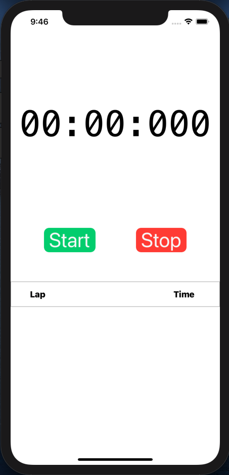
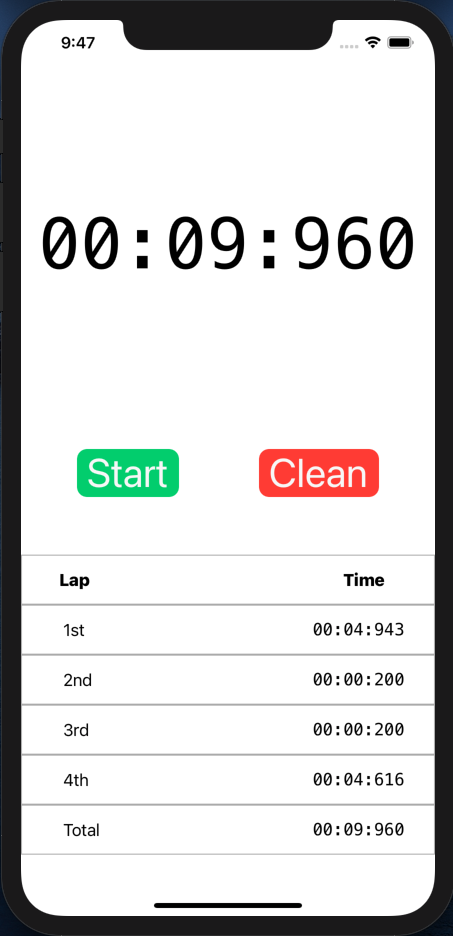
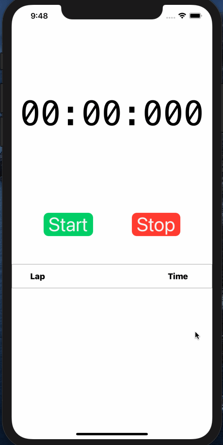
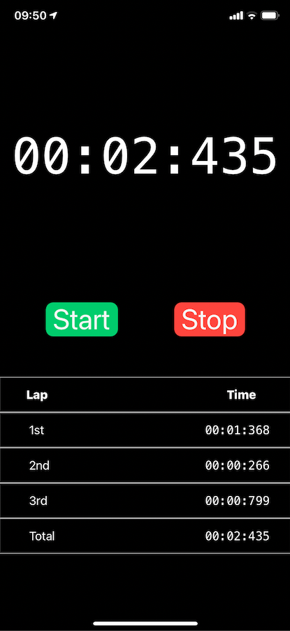

# Stopwatch iOS

## A simple stopwatch app for iOS

That's right! The best app ever made for iOS! 😍

Go on and have HOURS* of fun with this incredible stopwatch! ⌚︎
(**though it will only show you up to the minutes*)

**You can record several lap times**
And it will even show you the total time! Wow!

**Watch this watch!** 👀
Click on `Start` button, the watch will start count (incredible!) and the button then says `Next` so you can stop the previous lap and start the next in one move! 🏃‍♂️
In the last lap, click on the `Stop` button and it will show you the total time of all laps. The button then says `Clean` and you can click it to clean all the lap times and begin a new run! 🧹
Or you can click straight to the `Start` button after `Stop` to start a new run without losing time cleaning the previous one, if you`re a very busy business person who has no time to lose! 📋

It even works in landscape! 😱

And also in dark mode! 🌛

----

For some misterious reason, my brain put a space between `stop` and `watch` when i was naming the project. I know, that's sad 😥 🧠. 
But hey! Life give you some lemons, you go and make yourself a `stop watch`! (*Of course you wont make a lemonade, that's disgusting!* 🤢)
